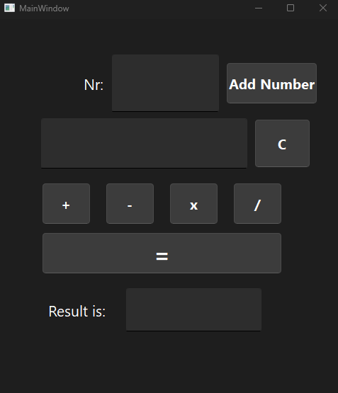

# CalculatorApp

**CalculatorApp** 

is a simple calculator built using **Qt and C++**. It allows users to perform basic arithmetic operations such as addition, subtraction, multiplication, and division. The application also includes a reset function and the ability to trigger calculations with the Enter key.

## Features

- **Basic Arithmetic**: Addition, subtraction, multiplication, and division.
- **Real-time Display**: Shows the equation and result in real-time.
- **Reset Button**: Clears the current equation and result.
- **Enter Key Support**: Adds the entered number to the equation by pressing the Enter key.
  
## Screenshot



## How to Use

1. Input numbers in the "Nr" field.
2. Click **Add Number** to add the number to the equation.
3. Choose an operation (e.g., +, -, x, /).
4. Press **=** to get the result.
5. Use the **C** button to reset the equation and start a new calculation.

## Getting Started

To run this project, ensure you have Qt installed on your machine. Clone the repository and open the project in **Qt Creator**.

### Clone the repository

```bash
git clone https://github.com/naderkharsa/CalculatorApp.git
